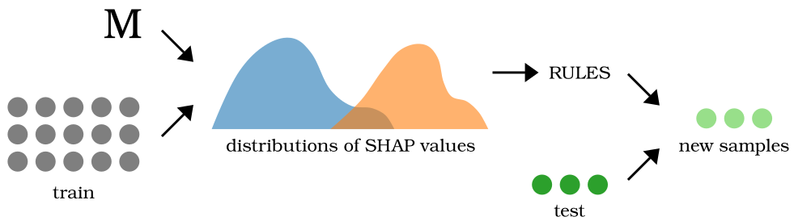

# Explanation-driven optimisation (EDO)

Currently, the code is being prepared for publishing. The progress can be tracked on branch `development`.

## What is EDO

Explanation-driven optimisation (EDO) is a transparent method to optimise drug candidates. It relies on explanations calculated by SHAP and derives a set of rules which guide the optimisation. These rules define what substructures should be added or removed from molecules to achieve the intended outcome and can be used to generate a huge number of modifications of the input molecule in a short time.

The rules derived by EDO are easy to understand and can be presented to a human expert which allows augmenting human expertise with the capability of AI methods to analyse big volumes of data. Moreover, EDO can be adapted to be used with any molecular property or to optimise other objects than molecules.

Model $M$ is used to calculate SHAP values for the training samples. The resulting distributions serve to derive rules which are applied to the test samples in order to generate optimised cantidates.

To the best of our knowledge, we are the first to demonstrate that explanations can be used for optimising molecular properties.
